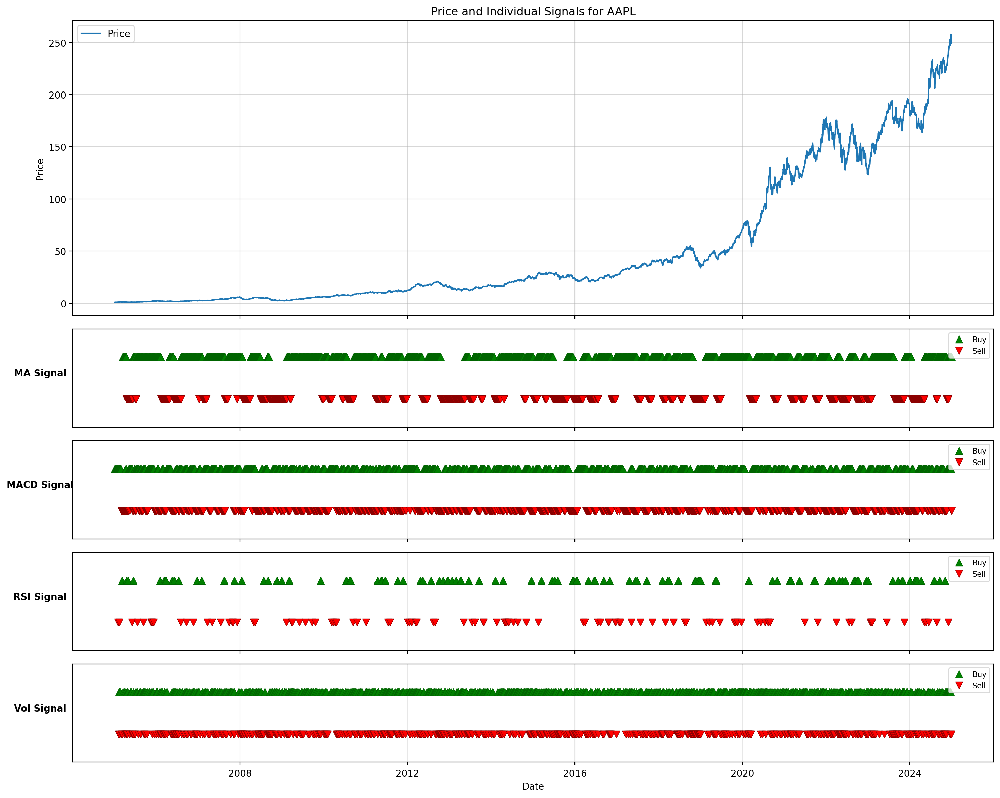

# FINM32500 - Homework 2

## Overview
A comprehensive backtesting framework for comparing technical trading strategies on S&P 500 stocks. This project implements four distinct trading strategies and evaluates their performance against a buy-and-hold benchmark. All strategies operate under realistic trading constraints including no shorting, no leverage, and transaction costs.

## Project Structure
```FINM32500HW2/
├── data/                          # Price data stored as Parquet files
├── src/                           # Source code
│   ├── PriceLoader.py            # Downloads and manages S&P 500 data
│   ├── BaseStrategy.py           # Core strategy framework
│   ├── BenchmarkStrategy.py      # Buy-and-hold benchmark
│   ├── MovingAverageStrategy.py  # Moving average crossover
│   ├── MACDStrategy.py           # MACD indicator strategy
│   ├── RSIStrategy.py            # RSI momentum strategy
│   └── VolatilityBreakoutStrategy.py  # Volatility-based breakout
└── StrategyComparison.ipynb      # Analysis and visualization notebook
```

## Strategies Implemented
1. **Benchmark Strategy** (Buy & Hold): The baseline strategy that simply buys and holds equal-weighted positions across all tickers. This represents a passive investment approach and serves as the performance baseline for all active strategies.
2. **Moving Average Strategy**:
- Logic: Uses crossovers between short-term (50-day) and long-term (200-day) moving averages.
  - Buy Signal: Short-term MA crossing above long-term MA
  - Sell Signal: Short-term MA crossing below long-term MA
- Behavior: This trend-following strategy aims to capture sustained price movements. It tends to lag turning points but excels in trending markets.
3. **MACD Strategy**:
- Logic: A momentum-based strategy that uses the MACD indicator to identify potential reversals.
  - Buy Signal: MACD line crossing above the signal line
  - Sell Signal: MACD line crossing below the signal line
- Behavior: This strategy is more responsive to price changes than the moving average strategy, making it suitable for capturing shorter-term trends and reversals.
4. **RSI Strategy**:
- Logic: A mean-reversion strategy that uses the RSI indicator to identify overbought/oversold conditions.
  - Buy Signal: RSI crossing below 30 (oversold)
  - Sell Signal: RSI crossing above 80 (overbought)
- Behavior: This strategy aims to capitalize on price corrections by buying when the RSI is low and selling when it is high.
5. **Volatility Breakout Strategy**:
- Logic: Trades on volatility expansion using 20-day rolling standard deviation.
  - Buy Signal: Price moves above the previous day's close plus a multiple of the rolling std deviation.
  - Sell Signal: Price moves below the previous day's close minus a multiple of the rolling std deviation.
- Behavior: Captures explosive price movements in either direction. Works well during high-volatility periods but may whipsaw in calm markets with random price fluctuations.

## Trading Framework
- **No Shorting**: Can only sell shares currently owned.
- **No Leverage**: Cannot buy more shares than cash available.
- **Transaction Costs**: Each buy/sell incurs a 0.35% transaction cost.
- **Fixed Position Sizing**: Trades in fixed share quantities per signal.
- **No Look-Ahead Bias**: Acts on previous day's signals.

## Usage
1. Download Data
```
from PriceLoader import PriceLoader

loader = PriceLoader(data_dir='data')
# Downloads all S&P 500 stocks from 2005-2025
loader.download_all_sp500(start_date='2005-01-01', end_date='2025-01-01')
```

2. Run Backtests
```
from PriceLoader import PriceLoader
from RSIStrategy import RSIStrategy
from MACDStrategy import MACDStrategy
from MovingAverageStrategy import MovingAverageStrategy
from VolatilityBreakoutStrategy import VolatilityBreakoutStrategy
from BenchmarkStrategy import BenchmarkStrategy

# Load price data
prices = PriceLoader('data').load_all()

# Run strategies
benchmark = BenchmarkStrategy().run(prices)
rsi_result = RSIStrategy().run(prices)
macd_result = MACDStrategy().run(prices)
ma_result = MovingAverageStrategy().run(prices)
vol_result = VolatilityBreakoutStrategy().run(prices)
```

3. Analyze Results
Each strategy returns a StrategyResult object containing:

- positions: Share holdings over time
- cash: Cash balance over time
- port_val: Total portfolio value over time
- cum_pnl: Cumulative profit/loss
- signals: Buy/sell signals generated

## Results Visualization
